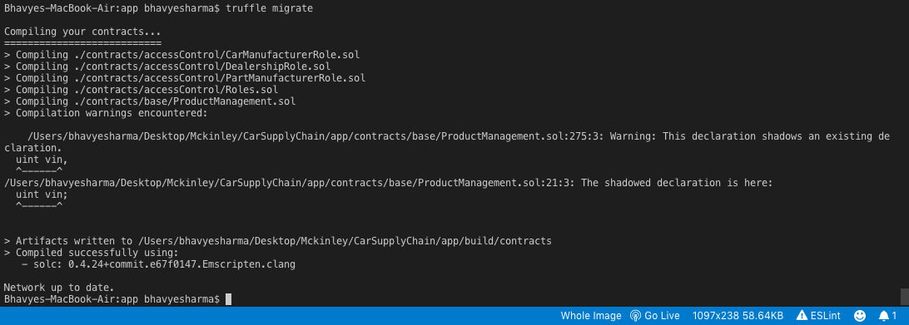
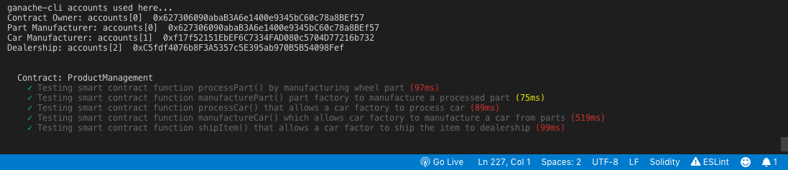

# The Car Manufacturing Story

This repository containts Smart contracts and tests that demonstrates a Supply Chain flow from car part manufacturer to a car dealership. The user story is similar to any commonly used supply chain process. A Part factory can process items to the inventory system and manufacture them all stored in the blockchain. A Car factory can use such items from the inventory system to process and build a car. Additionally a car factory supply the manufactured cars to dealerships of the brand.


## Getting Started

These instructions will get you a copy of the project up and running on your local machine for development and testing purposes. See deployment for notes on how to deploy the project on a live system.

### Prerequisites

Please make sure you've already installed ganache-cli, Truffle and update both of them.


### Installing

A step by step series of examples that tell you have to get a development env running

Clone this repository:

```
git clone https://github.com/howlla/<this_repository.git>
```

Change directory to ```app``` folder and install all requisite npm packages (as listed in ```package.json```):

```
cd app
npm install
```

Launch Ganache:

```
ganache-cli -m "spirit supply whale amount human item harsh scare congress discover talent hamster"
```

Your terminal should look something like this:


In a separate terminal window, Compile smart contracts:

```
truffle compile
```

Your terminal should look something like this:


This will create the smart contract artifacts in folder ```build\contracts```.

Migrate smart contracts to the locally running blockchain, ganache-cli:

```
truffle migrate
```

Your terminal should look something like this:



Test smart contracts:

```
truffle test
```

All 5 tests should pass.




## Built With

* [Ethereum](https://www.ethereum.org/) - Ethereum is a decentralized platform that runs smart contracts
* [Truffle Framework](http://truffleframework.com/) - Truffle is the most popular development framework for Ethereum with a mission to make your life a whole lot easier.


